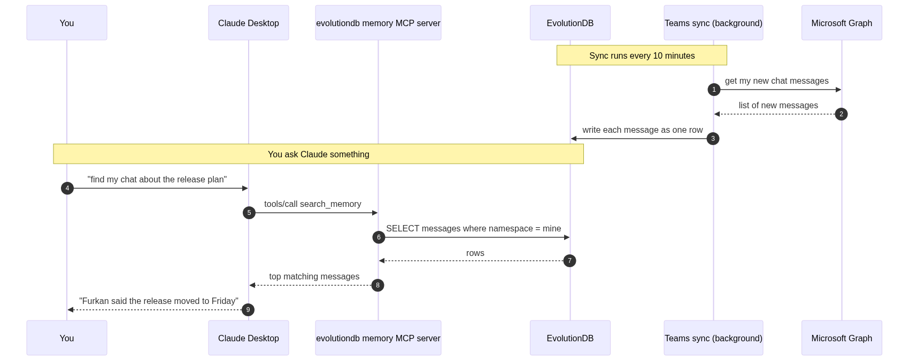

# Make Claude search your Teams chats

You know the feeling. Three weeks ago you sent a Teams message about
a release plan. Today you cannot find it. You scroll, you search by
name, you search by a word you think you used. Nothing. So you ask
the person again. They reply that yes, they said it, and you should
know already.

This happens to me almost every week. I got tired of it. So I built
a small tool that fixes it.

The tool reads my Teams chats and puts every message into a database.
Claude can also read from that same database. When I want to find
what someone said three weeks ago, I do not open Teams. I just ask
Claude in plain language. It finds the message and answers.

It works very well, and the setup takes about ten minutes.

## Why this matters more than it sounds

Teams keeps your messages forever. The real problem is finding them
again. The built in search is okay if you remember the exact words.
It is not good if you only remember the topic, or who said it, or
roughly when.

When you cannot find a past message, you waste time in small ways
that add up. You ask the same question twice. You miss a small detail
that becomes important later. Every Monday morning you spend the
first hour reading old chats just to remember where you were.

Here are some questions I now ask Claude without scrolling at all.

1. What did Furkan say about the new release plan last week
2. Find every chat where someone talked about the login bug
3. What did I write in the standup yesterday about the migration
4. Did anyone follow up on the budget meeting from two weeks ago
5. Show me the design review notes I typed in chat after the meeting
6. Pull out every action item from the platform team chat this month

Each of these used to take five to ten minutes of scrolling. Now it
is one question and one short answer.

## Where this helps the most

A few real places where this tool already saves me time.

**Release management.** Before we ship, I ask Claude to list every
chat from the last two weeks where someone reported a bug or asked
for a fix. It pulls the messages, groups them by chat, and tells me
which items were closed and which were still open. I no longer keep
a side document for this.

**Meeting notes.** Most of my team writes notes in chat after a
meeting, not in Notion or Confluence. The notes are there, but you
have to remember which chat. Now I ask Claude "find the notes from
the architecture review last Thursday" and it finds them.

**Catching up.** After a holiday or a sick day, instead of reading
two days of chat, I ask Claude what I missed. It summarises the
important threads and skips the small talk.

**Code reviews and decisions.** Half of our technical decisions live
in chat, not in PRs or design docs. I can now ask "why did we
decide not to use Redis for sessions" and get the actual conversation
where we made the call, with the reasons.

**Onboarding.** When a new person joins, instead of pointing at four
years of chat history, I tell Claude to summarise our team's
discussions on the topic they are starting on.

## What you end up with

A small program runs in the background. Every ten minutes it asks
Microsoft for any new Teams chat messages and writes each one into a
database row. The database is EvolutionDB, an open source SQL engine
that runs in a single Docker container.

Claude already knows how to talk to that database through the MCP
standard. MCP is a small open protocol that any AI assistant can use
to call tools. One of those tools reads from the same database the
sync writes to. So the write path is Teams to database, the read
path is Claude to database, and the database in the middle is the
single source of truth.

No vector store. No second product. No sync queue. One file on disk.

## How a question flows from start to finish

The diagram below shows what happens when you save a fact and later
ask for it back. The same shape applies to a Teams message. The sync
job writes one row, Claude reads it later.



The interesting part is that the same physical row serves both the
write and the read. There is no eventual consistency window. There is
no embedding job that has to finish first. The moment a Teams
message is saved, Claude can find it.

## Step one. Run the database

You only need Docker.

```bash
git clone https://github.com/alptekin/evolutiondb.git
cd evolutiondb
docker compose up -d
```

That gives you EvolutionDB listening on two ports.

* `5433` is the PostgreSQL wire port. The MCP server and any normal
  SQL client use this one.
* `9967` is the native EVO port. The bundled CLI and the C SDK use
  this one.

Check that it is alive.

```bash
docker compose ps
docker compose logs evosql --tail 10
```

You should see lines like `[PG] Listening on port 5433` and
`[EVO] Listening on port 9967`. That is the whole database. It
already has the memory and entity tables created and ready.

## Step two. Install the Teams sync

The sync is a small Python package on PyPI.

```bash
pip install evolutiondb-teams-sync
```

Then create a Microsoft Entra ID app for it. This is the part that
takes the longest, but you only do it once.

1. Go to [https://portal.azure.com](https://portal.azure.com) and
   open Microsoft Entra ID.
2. App registrations, then New registration. Name it whatever you
   like, for example "EvolutionDB Memory Sync".
3. Pick "Accounts in this organizational directory only".
4. Leave the redirect URI empty. Save.
5. Open Authentication and turn on "Allow public client flows". Save.
6. Open API permissions and add three Microsoft Graph delegated
   permissions. `Chat.Read` lets the tool read your one to one and
   group chats. `User.Read` lets it see who you are. `offline_access`
   lets it refresh the token without asking you to log in every time.
7. Copy the Application (client) ID and the Directory (tenant) ID
   from the Overview page.

Put those two values into a `.env` file next to where you will run
the sync.

```bash
AZURE_TENANT_ID=your_tenant_id_here
AZURE_CLIENT_ID=your_client_id_here
EVOSQL_HOST=127.0.0.1
EVOSQL_PORT=5433
EVOSQL_USER=admin
EVOSQL_PASSWORD=admin
EVOSQL_DATABASE=evosql
MCP_USER_ID=your_unique_id
TEAMS_MEMORY_STORE=mcp_mem
```

The `MCP_USER_ID` is the namespace your messages are filed under.
Pick something stable like your work email or a short handle and do
not change it later.

## Step three. Sign in once

```bash
evosql-teams-sync --auth
```

The terminal prints a Microsoft login URL and a short code. Open
the URL in any browser, paste the code, sign in with your work
account, and click Accept on the permissions screen. The refresh
token is saved on your machine and used for every later run.

You will not need to do this again unless you revoke the app or
change accounts.

## Step four. Pull your chats

Run a single sync to test that it works.

```bash
evosql-teams-sync --once --since 24h
```

You should see something like

```
wrote 118 messages across 42 chats (skipped 11 system / empty)
```

That is your last day of Teams chats now sitting in EvolutionDB.

For real use, run it as a daemon so new messages are picked up every
ten minutes.

```bash
evosql-teams-sync --interval 600
```

Or, if you prefer, run it in Docker as part of the same compose
stack with the `teams` profile.

## Step five. Point Claude at the database

Open Claude Desktop's config file.

On macOS

```
~/Library/Application Support/Claude/claude_desktop_config.json
```

On Windows

```
%APPDATA%\Claude\claude_desktop_config.json
```

Add the MCP server.

```json
{
  "mcpServers": {
    "evolutiondb-memory": {
      "command": "uvx",
      "args": ["mcp-server-evolutiondb"],
      "env": {
        "EVOSQL_HOST":      "127.0.0.1",
        "EVOSQL_PORT":      "5433",
        "EVOSQL_USER":      "admin",
        "EVOSQL_PASSWORD":  "admin",
        "EVOSQL_DATABASE":  "evosql",
        "MCP_USER_ID":      "your_unique_id",
        "MCP_STORE_PREFIX": "mcp"
      }
    }
  }
}
```

Two values matter here. The `MCP_USER_ID` must be the same one the
Teams sync writes under, otherwise Claude looks in the wrong place.
The port must be `5433`, the PostgreSQL wire port. The MCP server
uses the `psycopg` library, which speaks PostgreSQL. Pointing it at
`9967` is the most common mistake when something does not work.

Restart Claude Desktop fully. On macOS that is `Cmd Q`. Closing the
window is not enough. Open it again, start a new conversation, and
look at the bottom left of the window. You should see
`evolutiondb-memory` listed with a small green dot.

## Step six. Ask things

Try a few real questions.

> What did Furkan say about the release plan last week?

> Find every chat where someone mentioned a login bug.

> Summarise what I wrote in the Backend standup yesterday.

> Did anyone follow up on the budget meeting from two weeks ago?

Claude calls the `search_memory` tool. The MCP server runs a SQL
query over your messages, scores them by how well they match your
question, and returns the top few. Claude reads them and answers.

## Inspecting the data with normal SQL

This is the part I like the most. Because the data lives in a real
database, you can query it directly.

```bash
docker compose exec evosql /app/evosql-cli -W admin
```

Inside the CLI, count how many messages you have synced.

```sql
SELECT COUNT(*)
FROM __mem_mcp_mem
WHERE mem_namespace = 'your_unique_id';
```

Find every message that mentions a topic.

```sql
SELECT mem_value
FROM __mem_mcp_mem
WHERE mem_namespace = 'your_unique_id'
  AND mem_value LIKE '%login bug%';
```

Drop a row you do not want stored.

```sql
MEMORY DELETE FROM mcp_mem
WHERE NS = 'your_unique_id'
  AND KEY = 'teams_chat_19_xxxxx_yyyy';
```

You can also connect with any PostgreSQL client. DBeaver, pgAdmin,
the SQL pane in your editor, anything that speaks the PostgreSQL
wire protocol works.

Backup is one line.

```bash
docker cp evolutiondb-evosql-1:/data/evosql.db ./teams-memory-backup.db
```

That single file is your entire searchable Teams history.

## Common things that go wrong

**Wrong port.** If Claude says the MCP server is not responding, it
is almost always because the port is `9967` instead of `5433`. The
MCP server uses PostgreSQL wire.

**Restart, not relaunch.** Claude Desktop reads the MCP config only
when the app starts. After editing the config, fully quit the app
with `Cmd Q` and open it again.

**MCP_USER_ID mismatch.** If the Teams sync writes under one
namespace and Claude reads from another, your messages will not show
up. Use the same value in both places.

**Tenant admin lock.** If your company blocks the `Chat.Read`
permission, you cannot sync chats with this tool. Try running the
auth step first. If it fails with a tenant admin error, talk to your
IT team.

## Where this goes next

Once your data lives in a real database that Claude can query, the
assistant is no longer guessing. It is reading.

The same pattern works for any other source you can pull into rows.

* A Gmail connector that writes every email you receive.
* A Slack archiver that writes every public channel message.
* A GitHub watcher that writes every PR comment you are tagged in.
* A meeting transcript pipeline that writes every Zoom or Meet call.

All of them write into the same database. Claude reads from the same
database. You do not run a vector store, a document database, a
queue, and a SQL database to make this work. You run one engine.

That has been the biggest change for me. The assistant stopped being
something I had to re explain my context to every morning. It became
something that already knows what I said yesterday, what we
discussed last week, and what we decided last month. The papercut is
gone.

If you try this, I would love to know what use case you find for it
that I have not thought of yet.

_The full source code for the database, the MCP server, and the
Teams sync lives at github.com/alptekin/evolutiondb._
